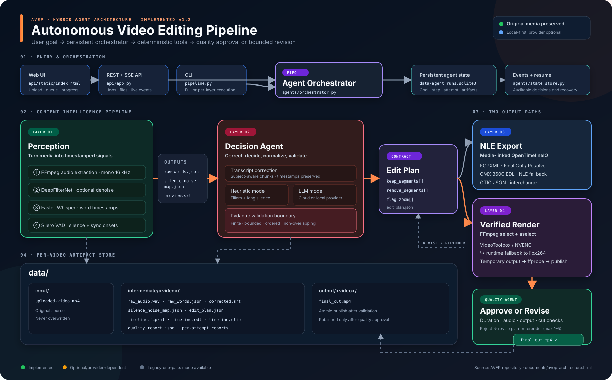

# AVEP — Autonomous Video Editing Pipeline

A hybrid video-editing agent system: a persistent orchestrator coordinates
deterministic media tools, an edit-decision agent, and a quality-control agent
until a render is approved or its bounded retry budget is exhausted.

## Architecture Map

[Open the full-resolution SVG](documents/assets/avep-architecture.svg) or
[download the PNG](documents/assets/avep-architecture.png).



## Architecture

Agent mode wraps the four media layers in a persistent control loop:

```text
User goal → Agent Orchestrator (SQLite state + event history)
               │
               ├─ Perception tool
               ├─ Edit Decision Agent
               ├─ Timeline export tool
               ├─ Render tool
               └─ Quality-Control Agent
                         │
                  approve ─┴─ revise/rerender → next bounded attempt
```

The original one-pass pipeline remains available when agent mode is disabled.

```
Input Video
    │
    ▼
┌─────────────────────────────────────────────────────┐
│  LAYER 1 — Perception                               │
│  Whisper transcription → VAD silence detection       │
│  Timestamp sync correction (auto-detects drift)      │
│                                                      │
│  Output:                                             │
│    raw_words.json        word-by-word + timestamps   │
│    silence_noise_map.json  silence regions + onsets  │
│    preview.srt           raw subtitle preview        │
└──────────────────────────┬──────────────────────────┘
                           │
                           ▼
┌─────────────────────────────────────────────────────┐
│  LAYER 2 — Decision Agent (LLM)                      │
│  Context-aware transcript correction                 │
│    "caucoss rule" → "Kirchhoff's rule"               │
│    "register" → "resistor"                           │
│  Heuristic filler/silence detection                  │
│  Edit plan generation (keep/remove/zoom segments)    │
│                                                      │
│  LLM providers:                                      │
│    • Claude Code (run inline, no API key needed)     │
│    • Claude API  (ANTHROPIC_API_KEY)                 │
│    • OpenAI      (OPENAI_API_KEY)                    │
│    • Gemini      (GEMINI_API_KEY)                    │
│                                                      │
│  Output:                                             │
│    corrected_transcript.json  fixed domain terms     │
│    corrected.srt              corrected subtitles    │
│    edit_plan.json             keep/remove/zoom       │
└──────────────────────────┬──────────────────────────┘
                           │
                           ▼
┌─────────────────────────────────────────────────────┐
│  LAYER 3 — Metadata Bridge                           │
│  Converts edit_plan.json → NLE timeline formats      │
│                                                      │
│  Output:                                             │
│    timeline.fcpxml       import into DaVinci/FCP     │
│    timeline.edl          import into any NLE         │
│    timeline.otio         versionable interchange     │
└──────────────────────────┬──────────────────────────┘
                           │
                           ▼
┌─────────────────────────────────────────────────────┐
│  LAYER 4 — Execution                                 │
│  FFmpeg render with hardware acceleration            │
│                                                      │
│  Output:                                             │
│    final_cut.mp4         rendered video              │
└─────────────────────────────────────────────────────┘
```

## Per-Video Output Folders

Each video gets its own output folder named after the source file:

```
data/
├── input/
│   └── College-Physics-Lecture.mp4
├── intermediate/
│   └── College-Physics-Lecture/
│       ├── raw_audio.wav
│       ├── raw_words.json
│       ├── silence_noise_map.json
│       ├── preview.srt
│       ├── corrected_transcript.json
│       ├── corrected.srt
│       ├── perception_output.json
│       ├── edit_plan.json
│       ├── timeline.fcpxml
│       ├── timeline.edl
│       ├── timeline.otio
│       ├── quality_report.json
│       └── quality_report_attempt_*.json
└── output/
    └── College-Physics-Lecture/
        └── final_cut.mp4
data/agent_runs.sqlite3        persistent agent state + event history
```

## Run the Web App (recommended)

The fastest way to use AVEP — a web UI with drag-drop upload, a job queue,
live per-layer progress, and downloadable outputs.

```bash
# Start the server (auto-creates .venv if missing)
./run.sh

# Custom port
./run.sh --port 9000
```

Then open:

| URL                          | What                                   |
|------------------------------|----------------------------------------|
| http://localhost:8000        | Web UI — upload, queue, live progress  |
| http://localhost:8000/docs   | Interactive API docs (Swagger)         |
| http://localhost:8000/queue  | Current queue state (JSON)             |

**Features**
- Upload multiple videos — they process one at a time via a FIFO queue
- Live progress over Server-Sent Events (per-layer status + completion)
- FPS auto-detected from the video (no manual entry)
- Edit plans validated before timeline export or rendering
- Final render verified with ffprobe before a job is marked complete
- Agent mode with user goals, quality review, bounded revisions, and resumable state
- Browse/download every intermediate + output file (`/data`, `/jobs/{id}/files`)

### API quick reference

```bash
# Upload + start pipeline
curl -X POST http://localhost:8000/upload \
  -F "video=@data/input/myvideo.mp4" \
  -F "subject=College Physics II" \
  -F "agent_mode=true" \
  -F "editing_goal=Keep technical explanations and use natural pacing" \
  -F "max_attempts=3"

# Check job status
curl http://localhost:8000/jobs/<job_id>

# Stream live events
curl -N http://localhost:8000/jobs/<job_id>/stream

# Download final cut
curl -O http://localhost:8000/jobs/<job_id>/download

# Inspect persisted agent state and decision history
curl http://localhost:8000/agent-runs/<agent_run_id>
```

## Quick Start (CLI)

```bash
# 1. Activate virtual environment
source .venv/bin/activate

# 2. Configure LLM provider in .env
#    Default: claude (uses ANTHROPIC_API_KEY)
#    Options: claude, openai, gemini
echo 'LLM_PROVIDER=claude' >> .env
echo 'ANTHROPIC_API_KEY=sk-ant-...' >> .env

# 3. Drop a video in data/input/
cp ~/Desktop/myvideo.mp4 data/input/

# 4. Run the full pipeline
python pipeline.py --video data/input/myvideo.mp4

# Run the agent system with quality/revision attempts
python pipeline.py --agent \
  --video data/input/myvideo.mp4 \
  --goal "Keep technical explanations and use natural pacing" \
  --max-attempts 3

# Resume a persisted run after interruption
python pipeline.py --agent --resume \
  --video data/input/myvideo.mp4 \
  --run-id agent_<id>

# 5. With subject hint for better transcript correction
python pipeline.py --video data/input/lecture.mp4 --subject "College Physics II"
```

## Run Individual Layers

```bash
# Layer 1 — transcription + silence detection + sync fix
python pipeline.py --video data/input/myvideo.mp4 --layer 1

# Layer 1 — skip denoise (faster, less memory)
python pipeline.py --video data/input/myvideo.mp4 --layer 1 --skip-denoise

# Layer 2 — transcript correction + edit plan (needs Layer 1 output)
python pipeline.py --video data/input/myvideo.mp4 --layer 2 --subject "Physics"

# Layer 2 — heuristics only, no LLM
python pipeline.py --video data/input/myvideo.mp4 --layer 2 --skip-llm

# Layer 3 — generate FCPXML/EDL
python pipeline.py --video data/input/myvideo.mp4 --layer 3

# Layer 4 — render final cut
python pipeline.py --video data/input/myvideo.mp4 --layer 4
```

## Using with Claude Code

Layer 2 LLM work can be done directly in Claude Code without an API key.
Run Layer 1 first, then ask Claude Code to:

1. Read `raw_words.json` and correct misheard domain terms
2. Generate `corrected_transcript.json` and `corrected.srt`
3. Generate `edit_plan.json` with keep/remove/zoom segments

## Import to Premiere Pro / DaVinci Resolve

- **SRT subtitles**: Import `corrected.srt` — creates a captions track
- **FCPXML timeline**: Import `timeline.fcpxml` into DaVinci Resolve or FCP
- **EDL timeline**: Import `timeline.edl` into any NLE
- **OTIO timeline**: Use `timeline.otio` for interchange, inspection, or version control

## GPU Support

| Platform       | Whisper Device | Render Codec         |
|----------------|----------------|----------------------|
| Apple Silicon  | cpu            | h264_videotoolbox    |
| NVIDIA GPU     | cuda           | h264_nvenc           |
| CPU only       | cpu            | libx264              |

## LLM Providers

Set `LLM_PROVIDER` in `.env`:

| Provider      | Configuration       | Current integration |
|---------------|---------------------|---------------------|
| claude        | ANTHROPIC_API_KEY   | Claude Sonnet 4.6   |
| openai        | OPENAI_API_KEY      | GPT-4o              |
| gemini        | GEMINI_API_KEY      | Gemini 2.0 Flash    |
| ollama        | Local Ollama server | Selected local model|
| claude_code   | Claude CLI login    | Existing CLI auth   |
